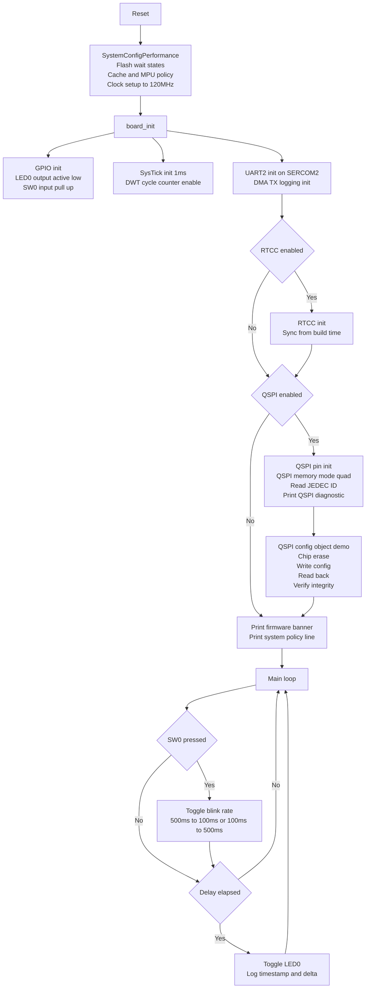

# SAME54_Project — Bare-Metal Firmware (ATSAME54P20A, SAME54 Xplained Pro)

Bare-metal firmware for the **Microchip ATSAME54P20A** on the **SAME54 Xplained Pro** board, built in **MPLAB X** with **XC32 (pic32c)** headers (`sam.h`) and direct `*_REGS` register access.

This project is a **bring-up + validation harness** that proves:
- deterministic **120 MHz** clocking (XOSC0 → DPLL0 → GCLK0/MCLK)
- **SysTick 1ms** timing + **DWT CYCCNT** profiling
- **RTCC** date/time
- **UART logging over SERCOM2** (EDBG VCOM) with **DMA TX**
- **QSPI external flash** bring-up (**SST26**) in **memory-mapped QUAD** mode, including **erase / write / read** of a config object with integrity checks.

---
## Board Profile Overview (SAME54 Xplained Pro)

This firmware targets the **Microchip SAME54 Xplained Pro** (ATSAME54P20A) and uses the board’s default on-board wiring for debug and user I/O. The project assumes the **EDBG** debugger is present and provides both programming/debug and a virtual COM port (VCOM).

### Power / Debug
- **EDBG USB** provides programming/debug via SWD and exposes a **VCOM UART**.
- **SWD pins:** PA30 (SWCLK), PA31 (SWDIO)
- **SWO trace:** PB30 (optional high-speed debug output)

### User I/O (hardwired on-board)
- **LED0:** **PC18**, **active-low**
  - `LED0_On()` drives low, `LED0_Off()` drives high
- **SW0 button:** **PB31**, **active-low**
  - Internal pull-up enabled (OUT=1 with PULLEN=1)

### UART Console (EDBG VCOM)
- **SERCOM2 UART** routed to EDBG Virtual COM:
  - **RX:** PB24
  - **TX:** PB25
- Default terminal settings: **115200, 8N1**
- Project uses **DMA-backed TX logging** for non-blocking prints.

### External QSPI Flash (on-board NOR)
- Board includes an external **QSPI NOR flash** connected to the SAME54 QSPI peripheral.
- QSPI signal wiring:
  - **PA08–PA11:** QSPI IO0–IO3
  - **PB10:** QSCK
  - **PB11:** QCS
- Firmware supports **memory-mapped QUAD mode** and prints JEDEC ID + diagnostic info at boot.

### Crystals / Clock sources
- **Main crystal (XOSC0):** 12 MHz (PB22/XIN1, PB23/XOUT1)
- **32 kHz crystal (XOSC32K):** 32.768 kHz (PA00/XIN32, PA01/XOUT32) used for RTCC/low-power domain

> Reference: SAME54 Xplained Pro cheat sheet and wiring notes.

---

## What you should see (sample log)

```
QSPI: JEDEC ID = 0x4326BF

================ CLOCK OVERVIEW ================
CPU Clock      : 120.000 MHz
CPU Source     : DPLL0
DPLL0 Output   : 120.000 MHz
DPLL0 Ref      : 1.000 MHz (GCLK2 = DFLL48M / 48)
GCLK0 Divider  : 1
CPU Divider    : 1
GCLK1 (Periph) : 120.000 MHz (DIV=1)
SysTick        : 1.000 ms tick
DWT CYCCNT     : ENABLED
RTCC           : ENABLED
===============================================

=============== QSPI DIAGNOSTIC ===============
QSPI Peripheral : ENABLED
QSPI Mode       : MEMORY
QSPI I/O Mode   : QUAD
QSPI BAUD       : BAUD=1  (~30.000 MHz)
Mem Opcode      : 0xAF
Mem Width       : 4-4-4
JEDEC ID        : 0xBF 26 43
Flash Detected  : VALID
=================================================

[SYS] CMCC=OFF, QSPI_MPU_NC=ON, QSPI_AHB=0x04000000, REGION=16MB

[SST26] ChipErase PASS in 39 ms (0.04 s)
[QSPI_FLASH] Write QSPI PASS in 19 ms addr=0x00008000 len=16
[QSPI_FLASH] Read  QSPI PASS in 0 ms  addr=0x00008000 len=16

[2025-12-27 08:51:26][727][0.000]LED0: OFF
[2025-12-27 08:51:27][1227][499.999]LED0: ON
```

---

## Toolchain / Packs (tested baseline)

This project was created in **MPLAB X v5.40** and validated with:

- **XC32 v4.50** (pic32c)
- **SAME54_DFP v3.5.87**
- **CMSIS v5.8.0**

> Tip: When opening the project in newer MPLAB X versions, avoid auto-upgrading packs unless you intend to update register symbols across the codebase.

---

## Hardware Profile (SAME54 Xplained Pro)

**User IO**
- **LED0:** PC18 (active-low)
- **SW0:**  PB31 (active-low, internal pull-up enabled)

**EDBG Virtual COM Port (SERCOM2)**
- **RX:** PB24
- **TX:** PB25

**SWO**
- **SWO:** PB30

**QSPI External Flash**
- Board default: Micron N25Q256A (varies by board rev)
- This firmware log shows **SST26** driver path in use.
- QSPI AHB base used by this project: **0x0400_0000**
- Region mapped: **16 MB**

---

## Project Structure

```
SAME54_Project/
├─ SAME54_Project.X/              # MPLAB X project
└─ src/
   ├─ main.c                      # bring-up harness loop (LED + periodic logs)
   ├─ common/
   │  ├─ board.c / board.h         # board init (GPIO + feature bring-up)
   │  ├─ cpu.c / cpu.h             # clocks/cache/boot diagnostics helpers
   │  ├─ systick.c / systick.h     # SysTick 1ms timebase
   │  └─ delay.c / delay.h         # non-blocking delay helpers (wrap-safe)
   └─ drivers/
      ├─ uart.c / uart.h           # SERCOM2 base UART
      ├─ uart_dma.c / uart_dma.h   # DMA-backed UART TX logging
      ├─ rtcc.c / rtcc.h           # RTCC init + time helpers
      └─ qspi/
         ├─ qspi_hw.c / qspi_hw.h  # QSPI peripheral + pinmux + low-level ops
         ├─ qspi_flash.c / .h      # flash abstraction + object read/write
         ├─ n25q/                  # Micron N25Q support
         └─ sst26/                 # SST26 support
```

---

## Build & Run

1. Open `SAME54_Project.X` in **MPLAB X**.
2. Select compiler: **XC32 v4.50**.
3. Build & program using the on-board **EDBG**.
4. Open a serial terminal:
  - **115200 baud**
  - **8N1**
5. Observe:
  - clock overview
  - QSPI diagnostic + JEDEC ID
  - RTCC time
  - QSPI erase/write/read tests
  - periodic LED log messages

---

## Firmware Flow (high level)

1. **SystemConfigPerformance()**
  - flash wait states
  - cache / MPU policy (including QSPI region attributes)
  - XOSC0 + DPLL0 to 120 MHz
  - GCLK0 + MCLK setup

2. **board_init()**
  - LED/SW pin config
  - SysTick 1ms
  - UART2 + DMA logging
  - RTCC init (if enabled)
  - QSPI init + JEDEC detection (if enabled)
  - diagnostic printouts

3. **main loop**
  - non-blocking periodic toggle/log of LED0
  - optional demo tasks can be added without blocking timing

---

## Configuration Switches (feature gating)

Features are enabled via compile-time defines (see `board.h` / project settings):

- `BOARD_ENABLE_RTCC` — enable RTCC init + time prints
- `USE_QSPI_FLASH`    — enable QSPI init + flash diagnostics/tests

> Keep core bring-up stable first (clocks/SysTick/UART), then enable RTCC/QSPI.

---

## Notes on Cache / MPU

The project prints a runtime policy line such as:

```
[SYS] CMCC=OFF, QSPI_MPU_NC=ON, QSPI_AHB=0x04000000, REGION=16MB
```

Meaning:
- CMCC cache currently OFF (can be enabled if desired)
- QSPI memory region is forced **Non-Cacheable** via MPU to avoid coherency issues
  during memory-mapped reads/writes.

---
## SAME54 Project firmware code flow

---

## License

Add your license here (MIT/BSD/Proprietary).

---

## Credits

Board: Microchip **SAME54 Xplained Pro**  
DFP/headers: Microchip SAME54 DFP (`sam.h`)
