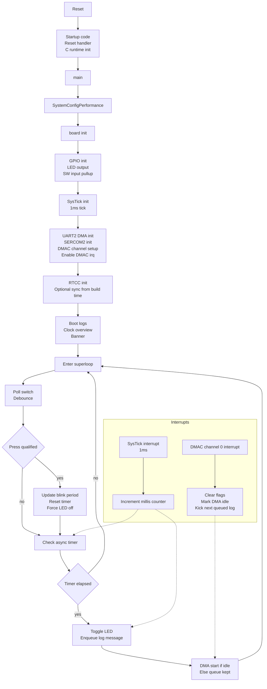
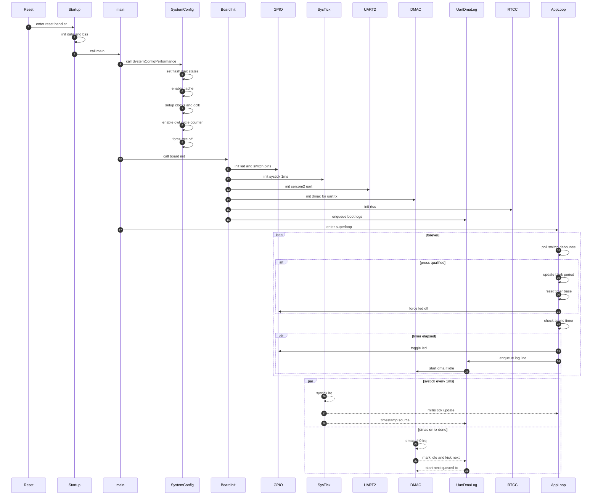
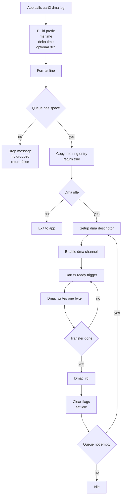
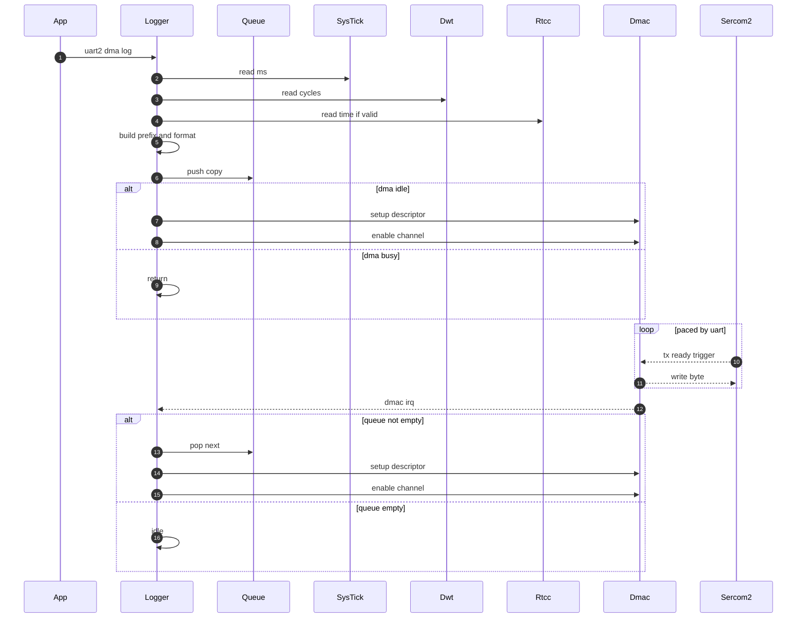
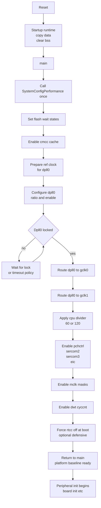
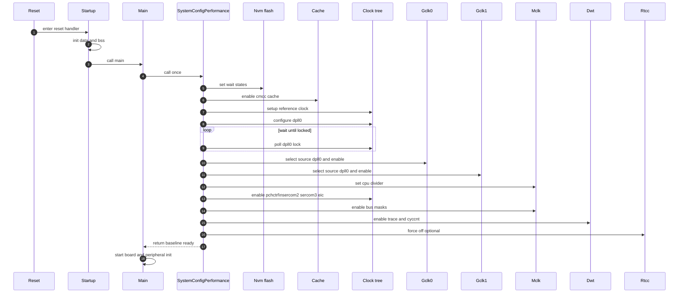
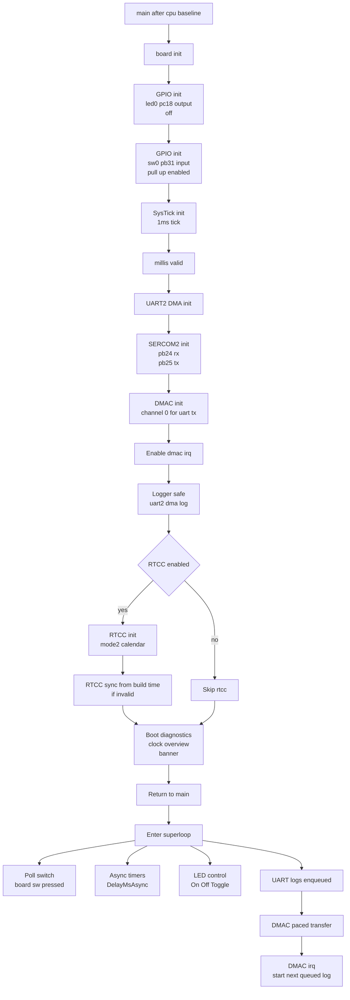
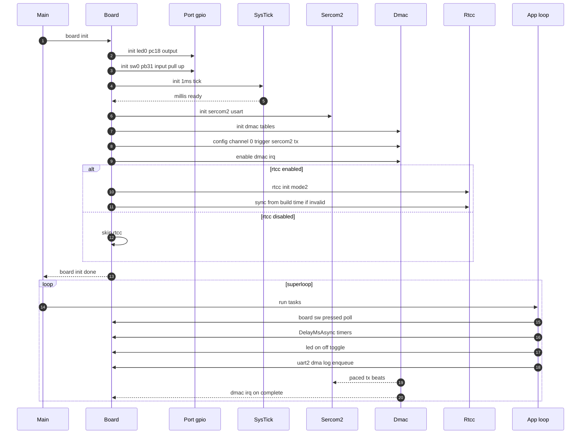
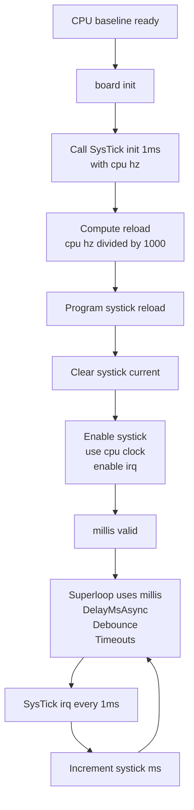
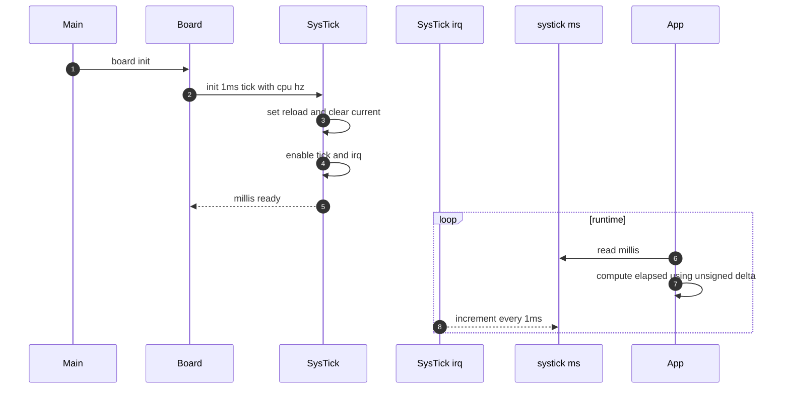

SAME54_Project/
├─ SAME54_Project.X/
│  ├─ Makefile
│  └─ nbproject/
│     ├─ configurations.xml
│     └─ project.xml
├─ src/
│  ├─ main.c
│  ├─ common/
│  │  ├─ board.c
│  │  ├─ board.h
│  │  ├─ cpu.c
│  │  ├─ cpu.h
│  │  ├─ delay.c
│  │  ├─ delay.h
│  │  ├─ systick.c
│  │  └─ systick.h
│  └─ drivers/
│     ├─ rtcc.c
│     ├─ rtcc.h
│     ├─ uart.c
│     ├─ uart.h
│     ├─ uart_dma.c
│     └─ uart_dma.h
└─ package.log

## Here’s the flow map diagram (Mermaid) for the full execution timeline from reset through runtime, including SysTick and DMAC involvement.

# DESIGN1— UART Logging Architecture (SERCOM2 + DMAC)

## 1. Purpose

Provide a reliable UART logging path on SAME54 Xplained Pro that:
- does not block the main loop
- supports frequent log calls
- prepends timestamps
- works at both 60 MHz and 120 MHz CPU configurations

This design uses:
- SERCOM2 USART for UART TX
- DMAC for non-blocking transmit
- SysTick for millisecond time
- DWT CYCCNT for fine delta timing
- optional RTCC for calendar time

## 2. Goals and non-goals

### Goals
- Non-blocking logging from main context.
- Efficient UART usage through DMAC pacing.
- Bounded memory usage.
- Deterministic behavior when queue is full.
- Prefix includes:
  - calendar time if RTCC valid
  - ms since boot
  - delta ms since previous log

### Non-goals
- ISR-safe logging from arbitrary interrupts.
- UART RX features.
- Guaranteeing delivery under heavy interrupt masking.

## 3. Modules and responsibilities

- drivers/uart.c / uart.h
  - SERCOM2 USART bring-up
  - basic blocking TX primitives (early boot / fallback)

- drivers/uart_dma.c / uart_dma.h
  - DMAC channel setup for SERCOM2 TX pacing
  - ring queue for log lines
  - formatting + enqueue
  - queue drain engine driven by DMAC completion IRQ
  - optional raw DMA send API

- common/systick.c / systick.h
  - 1 ms timebase: millis()

- common/cpu.c / cpu.h
  - enables DWT CYCCNT (delta timing)
  - establishes clock contracts used by UART baud

- drivers/rtcc.c / rtcc.h (optional)
  - calendar time source for prefix

## 4. Hardware and clock contracts

### UART
- SERCOM2 USART mode
- TX PB25, RX PB24 (EDBG VCOM)

### Clock contract (must remain true)
- SERCOM2 core clock is sourced from GCLK1
- GCLK1 frequency equals CPU frequency in this project
- CPU frequency is fixed after SystemConfigPerformance

If any contract is violated, UART may output garbage.

## 5. DMAC usage (UART TX)

- DMAC channel: 0 (reserved)
- Trigger: SERCOM2 TX ready trigger
- Beat size: byte
- Source increment: enabled
- Destination increment: disabled
- Destination address: SERCOM2 DATA register
- IRQ: block transfer complete (and error if enabled)

Transfer is peripheral-paced: one byte per trigger.

## 6. Initialization sequence

Logging becomes safe only after clocks, SysTick, and DMA are ready.

Required order:
1) SystemConfigPerformance()
  - stable clocks and GCLK generators
  - DWT CYCCNT enabled
2) SysTick init (1ms)
  - millis() becomes valid
3) UART2_DMA_Init()
  - UART2_Init() configures SERCOM2
  - DMAC base/writeback tables
  - channel 0 config + enable DMAC_0_IRQn
4) Optional RTCC init + seed if invalid

Rule:
- Do not call UART2_DMA_Log before UART2_DMA_Init.

## 7. Runtime behavior

### 7.1 Main-context logging API
UART2_DMA_Log(fmt, ...) does:
- build prefix (calendar optional, ms, delta)
- format final line into internal queue entry
- start DMA immediately if idle
- return true if queued
- return false if dropped or formatting failed

Design intent:
- main context only

### 7.2 DMAC completion interrupt
DMAC_0_Handler does:
- clear transfer complete flag
- clear error flag if set
- mark DMA idle
- start next queued entry if any

This ISR is the queue drain engine.

## 8. Timestamp format

Prefix format:
- calendar (optional)
  - [YYYY-MM-DD HH-MM-SS] if RTCC valid
  - [----] if RTCC invalid

- ms since boot
  - [MMMMMM] from millis()

- delta since previous log
  - [dddd.ddd] ms derived from DWT cycles converted to ms
  - recommend fixed-point conversion (3 decimals) or print integer ms only

Example:
[2025-12-23 16-00-00][001014][500.001] LED0 ON

## 9. Internal queue design

### 9.1 Storage model
- fixed-size ring buffer
  - QUEUE_DEPTH entries
  - each entry BUF_SIZE bytes

### 9.2 Indices
- head: next write
- tail: next send
- count: number of valid entries

### 9.3 Ownership
- logger copies formatted bytes into queue storage
- DMA reads from queue storage
- caller does not own data after enqueue

### 9.4 Concurrency control
- push and pop protected by masking DMAC_0_IRQn
- prevents races with DMAC_0_Handler

Constraint:
- not safe if UART2_DMA_Log is called from other interrupts
- supported usage is main context only

### 9.5 Queue full policy
If queue is full:
- increment dropped counter
- drop newest message
- return false

Design intent:
- never block main loop because of logging

## 10. Raw DMA send API

UART2_DMA_Send(buf, len) sends a buffer directly via DMAC.

Ownership rule:
- caller must keep buf valid until DMA completion IRQ fires

This API is primarily internal but can be used carefully for special cases.

## 11. Error handling policy

Known gaps:
- DMAC errors may clear flags but not fully recover channel state
- busy state is software-tracked and can desync if interrupts are masked too long
- unbounded wait loops anywhere in init can hang boot (avoid)

Recommended hardening:
- on DMAC error:
  - disable channel
  - clear descriptor
  - reset busy flag
  - restart next queued entry if present
- bounded timeouts for any SYNCBUSY or oscillator ready waits

## 12. Timing assumptions

- SysTick provides correct 1 ms tick
- CPU_CLOCK_HZ matches actual CPU clock
- DWT CYCCNT enabled and running

CYCCNT wrap:
- ~35.8 s at 120 MHz
- ~71.6 s at 60 MHz

Delta time is correct only if logs occur more frequently than one wrap interval
unless multi-wrap handling is implemented.

## 13. Verification checklist

Functional:
- boot banner prints while LED blink remains accurate
- logging does not stall main loop
- works cleanly at 60 and 120

Stress:
- spam logs and verify DMAC drains queue continuously
- force queue overflow and confirm dropped counter increments
- temporarily mask interrupts and confirm system continues and drops increase

# DESIGN2 — UART Console Integration (Files, APIs, Rules)

## 1. Purpose

This document is the integration guide for the UART console and DMA logger:
- where the code lives
- which APIs exist
- required init order
- rules that prevent misuse

Internals (queue, DMA pacing, timestamp math) are defined in:
- DESIGN1 section of this document.

## 2. File map

- src/drivers/uart.c / uart.h
  - SERCOM2 USART bring-up
  - minimal blocking TX primitives

- src/drivers/uart_dma.c / uart_dma.h
  - DMAC channel 0 setup for SERCOM2 TX
  - non-blocking log API
  - DMA completion ISR and queue drain engine

- src/common/systick.c / systick.h
  - SysTick 1 ms timebase (millis)

- src/common/cpu.c / cpu.h
  - clocks + GCLK contracts
  - DWT CYCCNT enable

- src/drivers/rtcc.c / rtcc.h (optional)
  - calendar time for log prefix

## 3. Hardware mapping contract

- SERCOM2 USART
- RX PB24
- TX PB25
- EDBG VCOM

Clock contract:
- SERCOM2 core clock comes from GCLK1
- GCLK1 frequency equals CPU frequency in this project
- CPU clock is fixed after SystemConfigPerformance

If you change any of these, re-validate UART baud.

## 4. Required init order

Hard rule:
1) SystemConfigPerformance() exactly once
2) board_init (or equivalent) calls:
  - SysTick init 1ms
  - UART2_DMA_Init()
  - optional RTCC init
3) Only after UART2_DMA_Init:
  - UART2_DMA_Log is safe

Do not log before UART2_DMA_Init.

## 5. Public API surface (expected)

### Low-level UART (blocking)
- void UART2_Init(void);
- void UART2_Putc(char c);
- void UART2_Puts(const char *s);

Use only for:
- tiny early boot prints
- fallback diagnostics
- Avoid in tight loops during normal runtime.

### DMA logger (non-blocking)
- void UART2_DMA_Init(void);
- bool UART2_DMA_Log(const char *fmt, ...);

Optional (careful use):
- bool UART2_DMA_Send(const void *buf, size_t len);
  - buffer must remain valid until DMA complete

## 6. Integration rules

- Use UART2_DMA_Log as the primary logging path.
- Do not call UART2_DMA_Log from interrupts other than the DMAC completion ISR path.
- Do not reuse DMAC channel 0 for other features.
- Do not change GCLK1 divider or source without updating baud assumptions and re-testing.
- Prefer a single timestamp policy:
  - ms from SysTick
  - delta from DWT
  - calendar optional from RTCC

## 7. Expected behavior under load

If logs exceed UART throughput:
- queue fills
- drops occur
- main loop remains responsive

If interrupts are masked for too long:
- DMAC completion IRQ is delayed
- queue drains slower
- drops increase

## 8. Extension plan (safe additions)

- Add UART RX in a separate module that does not modify TX DMA.
- Add UART2_DMA_Flush() before standby sleep.
- Add periodic reporting of dropped count.
- Add DMAC recovery on error (see DESIGN1 recommendations).

# DESIGN3 — RTCC (Real-Time Calendar Clock)

## 1. Purpose

The RTCC (Real-Time Calendar Clock) in this project provides:

- **Human-readable calendar time** (date + time)
- **Second-level resolution** timestamps for logging
- Optional **low-power wake-up** capability via RTCC alarms

RTCC is **not** used for:
- sub-millisecond timing
- high-precision delays
- active-mode scheduling

Those functions remain the responsibility of:
- SysTick (`millis()`) for ms-level time
- DWT CYCCNT for fine delta timing

---

## 2. Design goals

- Keep RTCC **logically independent** from SysTick and UART logging
- Allow RTCC to be **optional**
- Avoid breaking the canonical clock and init sequence
- Support **standby wake-up** without requiring high-speed clocks
- Fail safely if the RTC clock source is unavailable

Non-goals:
- Replacing SysTick
- Sub-second timestamp accuracy
- Timekeeping across power loss without backup battery

---

## 3. Architectural position

RTCC sits in the **platform services layer**, below application logic and above hardware registers.

Application
├── uses calendar time for logs
└── may schedule wake-up via alarm

Platform Services
├── RTCC (calendar + alarm)
├── SysTick (ms tick)
└── Delay (async timing)

Hardware
└── SAME54 RTC MODE2

RTCC does **not** depend on:
- UART
- DMA
- SysTick

UART logging optionally depends on RTCC for timestamp formatting.

---

## 4. Hardware configuration

### 4.1 RTC mode

- RTC runs in **MODE2 (calendar mode)**
- Fields used:
    - year, month, day
    - hour, minute, second

Calendar year range:
- Hardware supports limited year bits
- Project treats valid range as **2000–2063**

---

### 4.2 Clock source

RTCC clock selection is owned **exclusively by the RTCC module**.

Supported sources:
- External 32 kHz crystal domain (via 1K output)
- Internal ULP 1K clock (fallback option)

Design rule:
- RTCC must use a clock source that remains available in **standby**
- Clock selection must not be modified by `cpu.c` after RTCC init

---

## 5. Initialization sequence

RTCC initialization occurs **after** system clocks and UART are ready, but before the main loop.

Recommended order:
1. `SystemConfigPerformance()`
2. `board_init()`
3. `RTCC_Init()`
4. Optional: `RTCC_SyncFromBuildTime()`

RTCC is **never** initialized inside `SystemConfigPerformance()`.

---

## 6. Validity model

RTCC time is considered **valid** only if:
- the calendar year is plausible (e.g., ≥ 2020)
- RTC registers are not in reset state

If RTCC is not valid:
- logging uses placeholder date (`----`)
- RTCC may be seeded from build time

This allows:
- clean cold boot behavior
- deterministic timestamps without external time sources

---

## 7. Build-time seeding

On cold boot, RTCC may be seeded from:
- `__DATE__`
- `__TIME__`

Rules:
- Seeding happens **once**
- Only if RTCC is not already valid
- Build-time seeding is a convenience, not a precision source

---

## 8. Runtime usage

### 8.1 Logging timestamps

RTCC contributes only the **calendar prefix**:

[YYYY-MM-DD HH:MM:SS]

Other timestamp components:
- milliseconds since boot → SysTick
- delta time → DWT CYCCNT

If RTCC is invalid: 
[----]

---

### 8.2 Reading time

RTCC APIs provide:
- formatted date-time string
- raw calendar fields

Reads are synchronous and lightweight.

---

## 9. Alarm and wake-up design

### 9.1 Alarm purpose

RTCC alarms are intended for:
- low-power wake-up from standby
- coarse periodic scheduling (seconds or minutes)

They are **not** used for:
- fine-grained timing
- active-mode scheduling

---

### 9.2 Alarm behavior

- Alarm match triggers RTC interrupt
- ISR responsibility:
    - clear alarm flag
    - record wake reason
    - return immediately

Alarm ISR must remain minimal.

---

## 10. Power mode interaction

### 10.1 Active mode
- RTCC runs continuously
- Logging may query calendar time
- SysTick and UART remain active

### 10.2 Standby mode
- CPU and high-speed clocks are halted
- RTCC remains active
- SysTick is disabled
- RTCC alarm or EIC can wake the system

### 10.3 Resume
- RTCC calendar continues
- SysTick and UART are re-enabled
- Logging resumes normally

RTCC state survives standby transitions.

---

## 11. Error handling strategy

Known failure modes:
- clock source not starting
- syncbusy never clearing
- invalid calendar fields

Mitigation:
- bounded waits with timeouts
- fallback to placeholder timestamps
- never hard-hang the system in RTCC init

RTCC failure must not block:
- UART logging
- main loop execution

---

## 12. Constraints and assumptions

- RTCC resolution is **1 second**
- RTCC drift depends on clock source accuracy
- No battery-backed domain assumed
- Calendar accuracy is secondary to system liveness

---

## 13. Design invariants

The following must remain true:
- RTCC does not alter CPU or peripheral clocks
- RTCC does not depend on SysTick
- RTCC does not block the main loop
- RTCC alarm ISR remains minimal

Violating these invariants risks breaking:
- power-saving modes
- logging stability
- boot robustness

---

## 14. Future extensions (non-breaking)

- External time sync (GPS, host command)
- Periodic alarm scheduling helpers
- Multiple alarm slots (software-managed)
- RTC drift calibration

These extensions must preserve all invariants above.

---

# DESIGN4 — CPU Platform Bring-up (SystemConfigPerformance)

## 1. Purpose

The CPU platform layer provides a **single canonical bring-up sequence** that establishes:

- safe **flash wait-state** configuration for high-speed execution
- **CMCC cache** enablement for performance
- a stable **clock tree** (DPLL0 → GCLK0 / GCLK1)
- correct **CPU clock selection** (60 MHz or 120 MHz, via divider)
- required **peripheral clock routing** for core services (EIC, SERCOM2, SERCOM3)
- **DWT CYCCNT** enablement for sub-millisecond timing and log delta measurement
- a predictable baseline so all modules behave consistently

This project treats `SystemConfigPerformance()` as **canonical** and all peripherals must conform to its clock contracts.

Non-goals:
- runtime clock scaling
- dynamic frequency switching
- low-power entry sequencing (handled by a separate power module)

---

## 2. Design goals

- Bring up clocks in a deterministic, debuggable order
- Guarantee UART clock correctness for SERCOM2 logging
- Provide stable timing foundations for:
    - SysTick 1 ms tick
    - DWT delta timing
- Avoid dependency on Harmony PLIBs or CMSIS pointer-peripheral style
- Keep all configuration in one place to minimize hidden coupling

---

## 3. Architectural position

CPU platform layer sits below all board and driver code:

main
└─ calls SystemConfigPerformance once
└─ establishes clock + flash + cache + DWT baseline
└─ board_init and all drivers rely on this

Design invariant:
- `main()` must call `SystemConfigPerformance()` **exactly once** before any peripheral init.

---

## 4. Clock architecture

### 4.1 High-level model

- A reference clock is prepared for DPLL0
- **DPLL0** generates a high-speed clock domain
- **GCLK0** is sourced from DPLL0 and feeds the CPU domain
- **MCLK CPUDIV** selects the final CPU rate (60 or 120)
- **GCLK1** is also sourced from DPLL0 and feeds key peripherals

### 4.2 Supported CPU rates

This project supports two CPU configurations via divider:

- **120 MHz**: divider 1
- **60 MHz**: divider 2

Design invariant:
- CPU clock is **fixed after bring-up** (no runtime switching).

### 4.3 Peripheral generator contract

**Contract C1: GEN1 equals CPU clock**

- UART baud and SERCOM2 timing assume:
    - SERCOM2 core clock is sourced from **GCLK1**
    - **GCLK1 frequency equals CPU frequency**

The build system enforces this using compile-time checks in `board.h`.

Implication:
- Do not change GEN1 divider or source without updating UART logic and the contract.

---

## 5. Flash and cache configuration

### 5.1 Flash wait states

Before enabling or switching to high-speed clocks:
- configure NVM flash wait states to a safe value for the max operating frequency

Rationale:
- prevents flash fetch instability at high CPU speeds

### 5.2 Cache enablement (CMCC)

Enable CMCC early after flash settings:
- reduces average flash access latency
- improves throughput and responsiveness
- supports frequent logging without stalling execution

---

## 6. Peripheral clock routing

SystemConfigPerformance also prepares minimum routing for core project services:

- Enable peripheral GCLK channels (PCHCTRL) for:
    - **EIC** (button wake / input path)
    - **SERCOM2** (UART logging)
    - **SERCOM3** (reserved / optional use)

Design rule:
- Peripheral routing belongs to CPU platform layer only when it is part of the project’s base contract.
- Module-specific routing should remain in the driver where possible.

---

## 7. MCLK masks

The platform layer ensures required bus clocks are enabled via MCLK masks.

Current behavior:
- masks may be written as fixed constants

Risk:
- future peripherals may not function if their mask bit is not included

Design recommendation:
- prefer OR-based enabling when extending the project
- document any non-obvious mask requirements

---

## 8. DWT CYCCNT support

The CPU layer enables DWT cycle counting:

- `CoreDebug->DEMCR` trace enable
- `DWT->CTRL` cycle counter enable
- `DWT->CYCCNT` reset to 0

Uses:
- log delta time conversion to milliseconds
- microsecond-scale busy waits (DelayUs / DelayTcy)

Constraints:
- DWT CYCCNT is 32-bit and wraps quickly
    - ~35.8 s at 120 MHz
    - ~71.6 s at 60 MHz
- delta timing is reliable only within one wrap window unless multi-wrap handling is added

---

## 9. RTCC defensive handling

The platform layer may force RTCC off at boot to guarantee a clean state:

- disable RTC NVIC
- disable RTC peripheral and wait for synchronization
- clear mode and interrupt flags

Design invariant:
- RTCC clock selection and calendar setup belong to the RTCC module, not CPU.
- CPU layer should not configure RTCC time, only ensure “known disabled” baseline when needed.

---

## 10. Initialization timeline

Canonical sequence inside `SystemConfigPerformance()` is:

1. Configure flash wait states
2. Enable cache
3. Configure reference clock path
4. Configure and enable DPLL0
5. Route DPLL0 to GCLK0 (CPU) and GCLK1 (peripherals)
6. Apply CPU divider (60/120 selection)
7. Enable required peripheral GCLK channels
8. Apply MCLK masks
9. Enable DWT CYCCNT
10. Ensure RTCC is in a known safe state (optional defensive reset)

---

## 11. Error handling and robustness policy

Current common risks:
- infinite waits on oscillator ready
- infinite waits on DPLL lock
- infinite waits on SYNCBUSY

Hardening recommendation (non-functional change):
- introduce bounded timeouts for all wait loops
- on timeout:
    - fall back to safe clock mode
    - set a fault flag
    - provide LED fault pattern even before UART is ready

Design goal:
- **system liveness** is higher priority than performance clocks.

---

## 12. Assumptions and invariants

### Invariants
- `SystemConfigPerformance()` is called once before any peripheral init
- CPU clock remains fixed after bring-up
- GEN1 equals CPU clock
- SERCOM2 core clock is GEN1
- SysTick init uses the correct CPU clock value
- DWT CYCCNT is enabled in active mode

### Assumptions
- Default DFLL48M and reference clock path are usable
- Board wiring matches `board.h` pin map
- No low-power state changes clocks without an explicit resume path

---

## 13. Extending CPU platform safely

When adding new features:
- Do not alter GCLK1 divider without updating UART contract
- Add new PCHCTRL enables only if they are “platform-level services”
- Prefer OR-based MCLK enabling
- Keep module-specific clocking inside the module

---

## 14. Future extensions (non-breaking)

- Add formal clock validation helper:
    - compute and print GCLK0/GCLK1 frequency at boot
- Add configurable timeout policies for clock bring-up
- Add low-power entry and resume hooks:
    - suspend SysTick
    - flush UART DMA
    - resume clocks and re-enable base services

These must preserve all invariants.

---

# DESIGN5 — BOARD Layer (board.c / board.h)

## 1. Purpose

The BOARD layer is the project’s **BSP glue** that converts the canonical CPU baseline into a usable runtime platform:

- configures **user GPIO** (LED0, SW0)
- establishes the **1 ms timebase** (SysTick → `millis()`)
- brings up the **UART logging stack** (SERCOM2 + DMAC)
- optionally initializes **RTCC** for calendar timestamps
- provides small, stable helper APIs so application code stays clean

Design rule:
- BOARD must not modify the canonical clock configuration created by `SystemConfigPerformance()`.

---

## 2. Design goals

- Keep all board-specific wiring in one place (`board.h`)
- Make boot diagnostics available early (UART DMA logging)
- Keep main-loop logic cooperative and deterministic
- Provide a minimal, stable interface for:
    - LED control
    - switch read with debounce
    - boot banner and platform info

Non-goals:
- owning clock tree configuration
- advanced power management
- driver-level DMA configuration (owned by uart_dma)

---

## 3. Architectural position

main
├─ SystemConfigPerformance (canonical baseline)
├─ board_init (BSP init)
└─ while 1 (app superloop)

BOARD consumes services from:
- `cpu` (baseline clocks + DWT enabled)
- `systick` (ms tick)
- `uart_dma` (DMA-driven logging)
- `rtcc` (optional calendar time)
- `delay` (async scheduling helpers)

BOARD owns:
- board pin map macros
- LED and switch helper functions
- init ordering and “safe to use” guarantees

---

## 4. Hardware profile contract

### 4.1 User peripherals

- LED0: **PC18**, active-low
- SW0: **PB31**, active-low with pull-up

### 4.2 Console UART

- SERCOM2 USART on EDBG VCOM
- Pins:
    - RX: PB24
    - TX: PB25

### 4.3 Frequency contract

BOARD uses compile-time checks in `board.h` to enforce:
- `GCLK1_CLOCK_HZ == CPU_CLOCK_HZ`

This is required for UART baud stability.

---

## 5. Public API

Typical board API surface:

- `void board_init(void);`
- `void LED0_On(void);`
- `void LED0_Off(void);`
- `void LED0_Toggle(void);`
- `bool SW0_Pressed(void);` (raw read)
- `bool board_sw_pressed(sw_t *sw);` (debounced press detection)
- `void FW_LogBanner(void);`

Design intent:
- App code should rarely touch raw PORT registers directly.
- App code should call board helpers and drivers.

---

## 6. Initialization sequence

BOARD initialization must occur after the canonical CPU baseline is ready.

Recommended order inside `board_init()`:

1. **GPIO bring-up**
    - Configure LED0 pin as output, default OFF
    - Configure SW0 pin as input, enable pull-up

2. **SysTick init**
    - Configure SysTick to generate 1 ms ticks
    - `millis()` becomes valid after this step

3. **UART DMA logging stack**
    - `UART2_DMA_Init()` configures:
        - SERCOM2 USART pins and registers
        - DMAC base and writeback tables
        - DMAC channel for SERCOM2 TX pacing
    - Logging becomes safe after this step

4. **Optional RTCC init**
    - `RTCC_Init()` configures MODE2 calendar clock
    - `RTCC_SyncFromBuildTime()` may seed time if invalid

5. **Boot diagnostics**
    - print clock overview
    - print firmware banner

### 6.1 “Safe to call” timeline

- After SysTick init:
    - `millis()` is valid
    - debounce timers and async delays are valid

- After UART DMA init:
    - `UART2_DMA_Log()` is valid

- After RTCC init (optional):
    - calendar timestamps are valid

---

## 7. Runtime behavior model

BOARD is designed for a **cooperative superloop**:

- Application periodically calls:
    - `DelayMsAsync()` for periodic tasks
    - `board_sw_pressed()` for switch events
    - LED helper functions for state changes
- UART logging is non-blocking and drained by DMAC ISR

BOARD must not introduce long blocking waits in normal paths.

---

## 8. Switch debounce model

`board_sw_pressed(sw_t *sw)` implements press qualification:

Inputs:
- `sw->t_debounce` (ms threshold)
- `sw->id` (selects SW0)

Internal state:
- `static sw_state_t` (per-switch runtime state)
- tracks press start time, qualification status

Outputs:
- returns true once per qualified press
- increments `sw->cnt` on each qualified press

Design constraint:
- Switch handling must remain **non-blocking** to preserve superloop responsiveness.

(If the current implementation waits for release in a busy loop, it should be refactored into a state machine that completes across calls.)

---

## 9. Logging integration

BOARD is the earliest consumer of the UART DMA logger.

Rules:
- Logging should not be called before UART DMA init completes.
- Prefer a single logging path:
    - `UART2_DMA_Log()` for all boot and runtime logs

If `printf()` is used:
- it must be guaranteed that stdout is retargeted and UART is initialized first.

---

## 10. Error handling expectations

BOARD is a BSP layer and does not typically return errors, but it should support safe failure modes:

- GPIO config must not hang
- SysTick init must not hang
- UART DMA init should not hang
- RTCC init should not hang; if RTCC fails, the system should continue without calendar time

Recommended enhancements:
- add status flags for subsystem readiness
- avoid wait-forever loops in RTCC init
- provide LED fault pattern when UART is unavailable

---

## 11. Timing assumptions

- CPU clock is stable after `SystemConfigPerformance()`
- SysTick tick frequency derived from correct CPU clock
- `millis()` wraps at ~49.7 days; unsigned delta arithmetic is used
- BOARD debounce uses `millis()` deltas and is wrap-safe

---

## 12. Extending BOARD safely

When adding new hardware features:
- add pin mapping and polarity in `board.h`
- keep all board wiring macros centralized
- add helper functions only when they reduce duplicated app logic
- do not modify GCLK generator settings in BOARD

Examples:
- adding another LED: define pin + add `LED1_On/Off`
- adding another switch: add a `sw_state_t` entry and update `board_sw_pressed` routing
- adding SPI flash CS pin: define pin map in board.h, keep SPI driver separate

---

## 13. Design invariants

- BOARD does not alter canonical clocks
- BOARD init order remains:
    - GPIO → SysTick → UART DMA → optional RTCC → logs
- BOARD helper functions remain lightweight and safe for main-loop polling
- BOARD does not own DMA configuration

---

# DESIGN6 — SysTick Timebase (systick.c / systick.h)

## 1. Purpose

The SysTick module provides the project’s **primary millisecond timebase****:

- a monotonic **1 ms tick counter** (`systick_ms`)
- a lightweight API (`millis()`) used for:
    - non-blocking scheduling (`DelayMsAsync`)
    - debounce timing (`board_sw_pressed`)
    - log timestamps (ms field in prefix)
    - active-mode timeouts (polling loops)

SysTick is **not** intended for:
- sub-millisecond measurement (handled by DWT CYCCNT)
- long-term calendar time (handled by RTCC)
- precise periodic scheduling under heavy interrupt masking

---

## 2. Design goals

- Provide a simple, deterministic 1 ms time source
- Be safe across `uint32_t` wrap-around using unsigned subtraction
- Keep the interrupt handler minimal
- Avoid hidden dependencies on peripherals
- Support both 60 MHz and 120 MHz CPU configurations

Non-goals:
- tickless low-power scheduling
- RTC replacement
- per-task timer framework

---

## 3. Architectural position

SysTick is a core service used by multiple modules:

- `delay.c` uses it for ms delays and async timing
- `board.c` uses it for switch debounce and periodic actions
- `uart_dma.c` uses it for timestamp prefixing and optional flush timeouts
- app logic uses it indirectly via these helpers

SysTick assumes the CPU baseline is already configured by `SystemConfigPerformance()`.

---

## 4. Public interface

Typical exported items:

- `void SysTick_Init_1ms(uint32_t cpu_hz);`
- `uint32_t millis(void);`
- `extern volatile uint32_t systick_ms;`

### 4.1 millis()
Returns the current uptime in milliseconds.

Properties:
- monotonic increasing during active mode
- wraps at ~49.7 days (`2^32 ms`)

Consumers must use unsigned delta arithmetic:
- `if ((uint32_t)(now - start) >= timeout_ms)`

---

## 5. Initialization

SysTick must be initialized **after** the CPU clock is stable.

Init order:
1. `SystemConfigPerformance()` establishes CPU clock
2. `board_init()` calls `SysTick_Init_1ms(CPU_CLOCK_HZ)`

### 5.1 1ms reload calculation

The reload value is based on:

- `reload = (cpu_hz / 1000) - 1`

Design invariant:
- `cpu_hz` passed to SysTick init must match actual CPU clock,
  otherwise the entire timebase becomes scaled wrong.

---

## 6. Interrupt handler behavior

SysTick interrupt occurs every 1 ms.

Handler responsibilities:
- increment `systick_ms`

The handler must remain minimal:
- no logging
- no blocking
- no heavy computation

---

## 7. Timing guarantees and limitations

### 7.1 Guarantees (active mode)
- `millis()` increments roughly once per ms, as long as interrupts run
- unsigned subtraction makes timeouts wrap-safe for typical durations

### 7.2 Limitations
- If interrupts are disabled for long periods:
    - `systick_ms` stops incrementing
    - delays and debounces extend
    - periodic timers drift
- SysTick provides no guarantee of exact real-time accuracy under load
- During standby sleep:
    - SysTick is typically disabled
    - `millis()` pauses (expected behavior)

---

## 8. Concurrency and data ownership

- `systick_ms` is written by:
    - SysTick ISR only (single writer)
- `millis()` reads `systick_ms`:
    - multi-reader, race-safe for 32-bit reads on Cortex-M

No additional locking is required.

---

## 9. Integration rules

### 9.1 Where SysTick may be used
- main loop scheduling
- debounce logic
- active-mode timeouts
- log timestamping

### 9.2 Where SysTick should not be used
- as a precise microsecond delay source
- as a wake source for low-power modes
- inside long critical sections that mask interrupts

---

## 10. Portability considerations

SysTick is Cortex-M standard and portable across MCU families,
but correctness depends on:

- correct CPU clock configuration
- correct reload calculation
- consistent init order

This project also assumes:
- CPU clock is static after bring-up
- 60/120 MHz selection is compile-time or fixed at boot

---

## 11. Error handling

SysTick init can fail logically if:
- `cpu_hz` is wrong (timing scaled wrong)
- reload value exceeds SysTick counter width
- SysTick interrupt priority conflicts with other real-time demands

Recommended enhancements:
- add compile-time validation for typical CPU ranges
- optional runtime assert:
    - if `(cpu_hz % 1000) != 0`, document rounding behavior

---

## 12. Design invariants

- SysTick init happens after canonical CPU clock setup
- SysTick ISR only increments the ms counter
- No module relies on SysTick for sub-ms measurement
- All consumers use wrap-safe unsigned delta arithmetic

---

